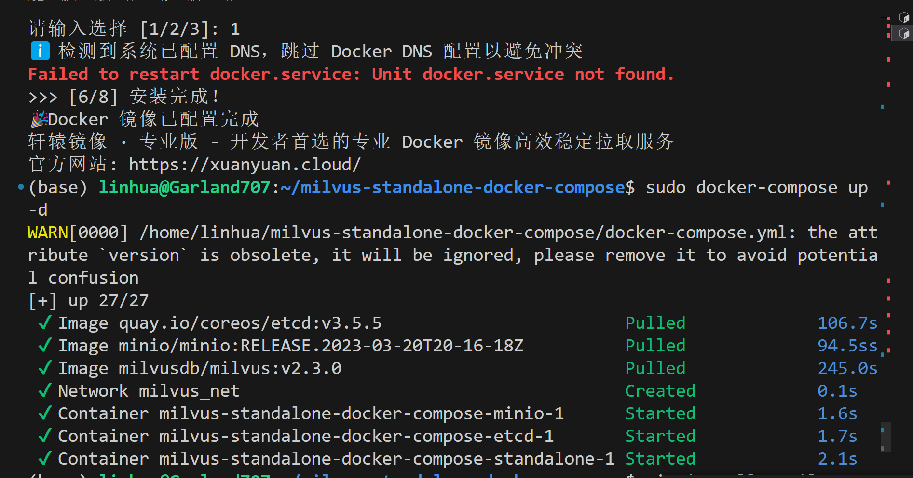

2026.4.21
因为最近在学ai，了解ai相关，想熟练使用ai，所以跟着瞎做装了不少东西，现在我的c盘变红了，所以我想着，先把我的wsl切到d盘，然后结合ai，数据库，尝试着做点有用的项目。

然后想着在安装计算的时候，空余时间很浪费，我也想着就是把这些都记录下来。现在的我已经在做第二步了。根据ai的指示，我先把我的wsl环境布置了下，装了conda，还有把这两天刚刚搞定的ssh重新连上了。接下来是这个项目的整体流程，第一阶段：架构设计
我们将系统分为三个模块：
1.  采集器 (Scanner)：Python 脚本，负责遍历硬盘，提取文件元数据（路径、大小、时间），并调用 Embedding 模型生成向量。
2.  大脑与记忆 (Brain & Memory)：
    *   Milvus：存储文件信息的向量，用于语义搜索（例如搜“大文件”、“缓存”）。
    *   Qwen (llama.cpp)：作为分析引擎，根据检索到的数据生成清理建议。
3.  执行终端 (Interface)：一个 Web 界面，展示分析结果，你点击确认后，通过 SSH 下发清理指令。

第二阶段就是环境部署，为此我把docker默认的wsl也切了过来，wsl中是可以操作windows中安装的docker的，本来是不行的，docker按理和wsl同级（wsl作为的是linux虚拟机），应该相当于是搭建了通道方便使用吧。这次的数据库用的是Milvus，我之前都没听过，这是向量数据库。本来我想着mysql如果可以的话就用mysql，可是ai还是推荐我使用它。向量数据库和ai的相性好，那么在这个项目中，我前几天花了好些功夫搭建好的mysql环境在这里是用不上了。然后接着回去讲这个项目，这里创建了一个docker-compose.yml的文件，里面说是使用docker compose一键启动Milvus，然后就是run 它：docker-compose up -d
不过这里又遇到了之前头疼的问题，这里也要从docker hub扒镜像。我上次弄了好几天都没弄好，弄那个mysql的镜像，首先是ai一直反复推的镜像站全都挂了，我试了好久才发现。😖然后呢，就上网找办法，还是个小白，也不知道怎么用别人给的链接，后来歪打正着，找到个可以离线下载镜像的，我又花了好久好久以几k的速度下完了。还好他稳定，那个时候简直是我的救赎。下完之后也没理解他十分什么原理。这之后刷视频，刷到说可以通过aliyun，百炼平台建立flow在服务器上，通过nginx反向代理，用ali香港的服务器群从docker hub上面扒下来然后反向代理下载下来。整个原理大概是这样，但是我是vibe coding嘛，中间的操作又不理解，又出错了好多次，ai教我这样设置，失败了，反复问ai看他也回答不出什么来了，只好放弃，回去跟博主一步一步做，然后一摸一样的步骤，又出问题了……后来不知道到怎么改的参数，成功了一次，看着那个flow总算绿了，我都想直接开香槟了。确实扒下来了一个，但也不知道是啥，不会用，而且一摸一样的设置再爬一次就失败了，再也没成功过。问题不是网络啊什么的，是我的仓库中就是没有文件，应该是设置和代码中有问题，docker hub和云服务器之间就没传过文件。现在反正是搁置了。之后有时间吧，要是我还是需要这个，并且对这些东西有了更深的了解再去处理它吧。就这样啦。然后就是今天，当我看到报错说是docker hub相关，我心又凉了半截，但是我抱着试一试的想法，记得轩辕有免费版，就又去试了。结果轩辕还是失败了，不过呢有转机，我看到人家推的另一个镜像，DaoCloud，我也去试了一试，结果成功了！！！！我长舒一口气，总算是能继续推下去了。然后就是第二阶段的第一部分完成，现在正在做第二部分，在安装milvus，安装了又有好一会，现在也不会因为他太慢而着急，只要他能动，在动，我就谢天谢地了。果然第二部分也没什么内容，就下的久了点，现在所有的东西都安装好了，接下来进入第三阶段

