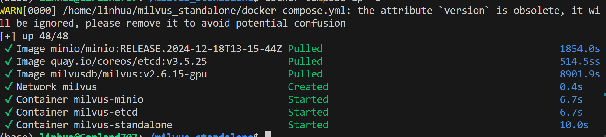

2026.4.22
今天就继续之前的任务，问题太多代码太多，我开了好几个窗，找起来好累，还要承接上下文问问题，效率好低，我迟早要优化这个讨厌的玩意儿。
昨天装好了milvus和vllm，今天又要重新再装一遍，因为一个大问题没提前反应过来。我装了conda，所以根据ai的建议，这两个部分都是装在独立的环境中的，那就不能一起用了，所以我碎了。今天就是重新找方法，了解了conda和docker的区别，所以说用docker更好，现在就是把这两个都装在独立的image中，然后一起调用就行了，如果是conda就得制作备份，我觉得会占内存，因为我还要跑模型嘛，这两个组件之后还要做很多事。然后就是要部署docker的环境，因为vllm需要gpu支持，这样又要布置让docker的镜像能够访问gpu。现在环境已经布置好了，在部署milvus。成功啦！好耶！（虽然下了两个半小时）
